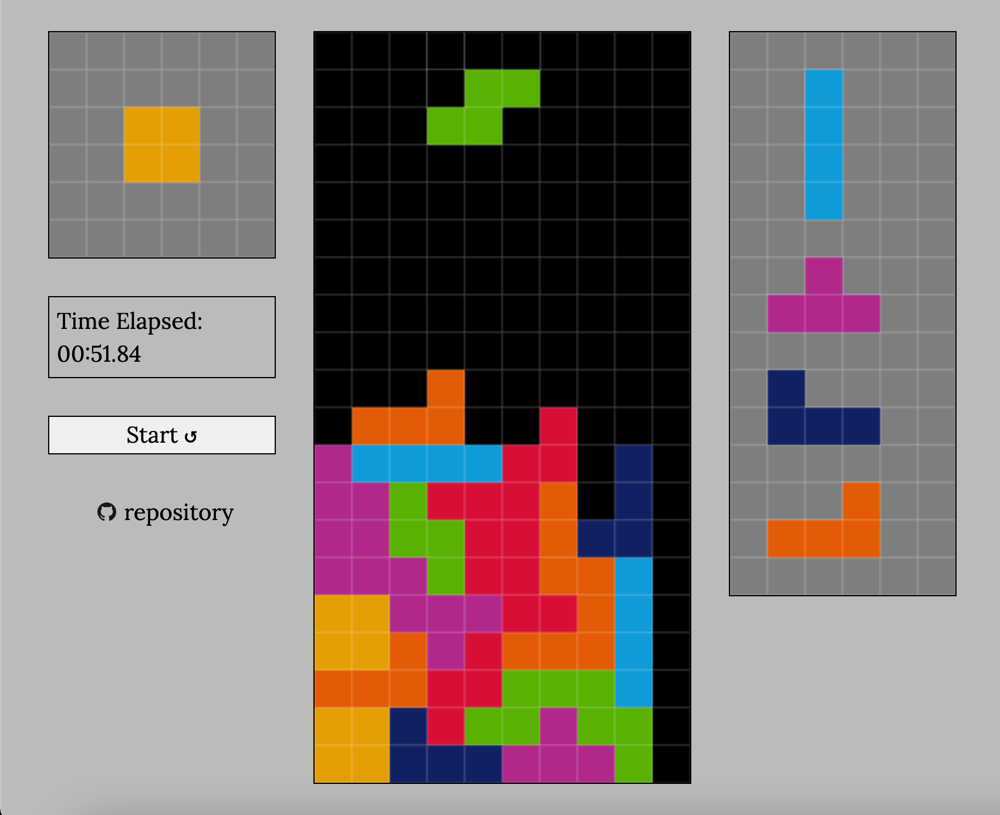

# Tetris

## Project Setup
```bat
npm install
```

## Bundle & Compile Typescript
```bat
npm run build
```

## Spin up a Local Development Server
```bat
webpack serve
```

## About
A Typescript implementation of the Classical Game of Tetris.



## Game Controls

|Function       |Key      |
|---------------|---------|
|Move Left:     |`left`   |
|Move Right:    |`right`  |
|Soft Drop:     |`down`   |
|Hard Drop:     |`space`  |
|Rotate Left:   |`z`      |
|Rotate Right:  |`up`     |
|Rotate 180:    |`a`      |
|Hold:          |`c`      |


## Contribute
Feel free to open issues & make pull requests, I'll try my best to work on them.
